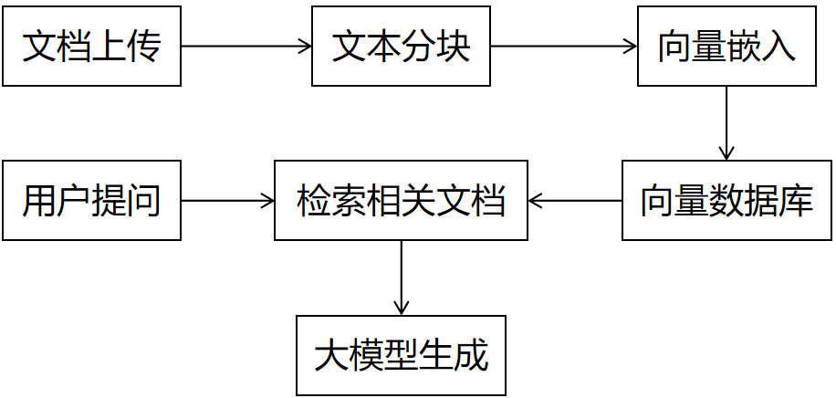

# 🏢 私有知识库系统 (RAG)

基于 **LangChain** + **阿里云通义千问** + **Streamlit** 构建的现代化私有数据智能问答系统。

## 💡 1. 为什么要使用 RAG？

在企业级 AI 应用中，直接使用通用大模型通常会面临以下三大痛点：

1.  **🔒 数据隐私安全**：企业的核心业务数据、财务报表、内部规章等绝对不能随意上传给第三方公共大模型。
2.  **🧠 垂直领域知识缺乏**：通用大模型是基于公开互联网数据训练的，它不懂你们公司内部的特有术语、专有产品和业务逻辑。
3.  **⏱️ 实时性滞后**：大模型的知识停留在其训练完成的那一刻，无法回答关于最新产品发布、最新政策变动的问题。

**RAG (Retrieval-Augmented Generation, 检索增强生成)** 正是解决上述问题的最佳行业标准方案。简单来说：**它不要求大模型死记硬背你的知识，而是给大模型配备了一个“超级搜索引擎”，让它带着你的私有文档“开卷考试”。**

-----

## ⚙️ 2. 系统核心原理与架构

本系统严格遵循标准的 RAG 处理流水线。整体架构如下图所示：


结合本项目的代码实现，整个系统分为两个核心阶段：**离线知识库构建阶段** 和 **在线检索问答阶段**。

### 📌 阶段一：知识库构建 (离线数据摄入)

对应代码：`load_documents` -\> `split_documents` -\> `build_vectorstore`

1.  **文档上传与解析 (Document Loading)**：系统支持读取本地文件夹中的 `.pdf`, `.txt`, `.docx` 文档，将其转化为程序可读的纯文本数据。
2.  **文本分块 (Text Splitting)**：由于大模型的单次阅读字数（Context Window）有限，系统使用 `RecursiveCharacterTextSplitter` 将长篇大论切分为大小合适的段落片段（例如每块 500 字），并保留一定的上下文重叠（Overlap），防止一句话被从中间截断。
3.  **向量嵌入 (Vector Embedding)**：调用阿里云的 `DashScopeEmbeddings`，将每一块文字转化为高维数学向量（一串复杂的数字）。语义越相近的文字，它们在多维空间中的距离就越近。
4.  **向量数据库存储 (Vector Database)**：将带有原文本的向量数据持久化保存到本地的 `Chroma` 数据库中（即 `./vector_db` 目录），实现“一次构建，永久加载”。

### 📌 阶段二：智能问答 (在线检索增强)

对应代码：`setup_qa_chain` -\> `ask`

1.  **用户提问 (Query)**：用户在 Web 界面输入自然语言问题。
2.  **检索相关文档 (Retrieval)**：系统将用户的问题同样进行“向量化”，然后去 `Chroma` 数据库中计算余弦相似度，提取出与问题语义最匹配的 Top-K 个文档片段（也就是参考来源）。
3.  **大模型增强生成 (Augmented Generation)**：
   * 使用 **LCEL (LangChain 表达式语言)** 架构，将【提取出的文档片段】和【用户的问题】无缝组装到提示词模板（Prompt Template）中。
   * 引导大模型：*“请使用以下检索到的上下文来回答问题...如果你不知道答案，就说不知道。”*
   * 大模型（通义千问 `qwen-plus`）根据提供的上下文，进行逻辑归纳并生成最终答案。

-----

## 🚀 3. 项目特色与技术栈

* **纯净的前后端分离**：`rag.py` 专注底层数据处理与大模型链路，`web_ui.py` 专注用户交互。
* **现代 LCEL 架构**：采用 LangChain 最新的 `RunnablePassthrough` 和 `RunnableParallel` 数据流写法，告别被弃用的旧版 API。
* **丝滑流式输出**：接入模型 `streaming=True`，配合 Streamlit `st.empty()`，实现类似 ChatGPT 的逐字打印“打字机”效果。
* **精准溯源**：在回答下方提供可折叠的参考原文面板，大模型说的每一句话都有据可查，杜绝 AI 幻觉。

-----

## 📂 4. 目录结构

```text
├── documents/           # 存放原始私有文档 (PDF/Word/TXT)
├── vector_db/           # Chroma 向量数据库本地持久化目录 (自动生成)
├── .env                 # 环境变量配置文件 (手动创建)
├── rag.py               # 后端核心逻辑：加载器、切分器、向量库与 LCEL 链
├── web_ui.py            # 前端交互界面：Streamlit 聊天 UI 及流式渲染
└── README.md            # 项目说明文档
```

streamlit run web-ui.py --server.port 8501
